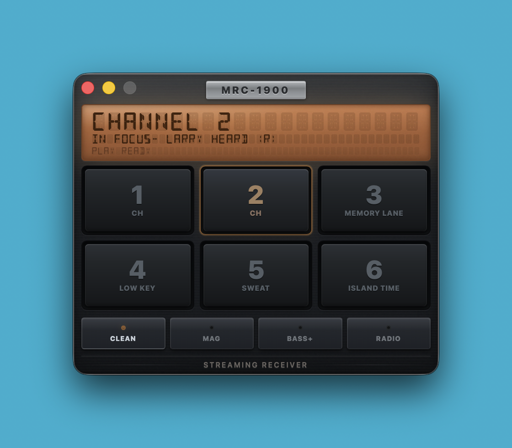

# Marconio

A desktop internet radio that looks and feels like a piece of hardware you'd find in a late-2000s Honda. Marconio streams [NTS Radio](https://www.nts.live) — both live channels and their catalog of mixtapes — through a native audio engine with a handful of audio effects you can toggle on the fly.

The whole thing fits in a small fixed-size window. There's an amber LCD, six preset buttons, a row of FX keys, and not much else.

## Using it



The two left presets are locked to NTS Channel 1 and Channel 2 (live). The remaining four are yours — right-click to assign any NTS mixtape. Tap a preset to start listening. Tap the LCD to cycle through display themes (amber, blue, green, pink).

The FX row at the bottom lets you color the sound:

- **Clean** — straight through, no processing
- **Mag** — tape warble, gentle compression, a little warmth
- **Bass+** — low-end boost with some saturation
- **Radio** — mid-heavy, compressed, like a speaker in a dashboard

Keyboard shortcuts work the way you'd expect: `1`–`6` for presets, `Space` to play/stop, `Esc` to close menus.

On macOS and Windows, Marconio can live in your menu bar / system tray instead of the dock. The tray icon shows which preset you're listening to, and right-clicking it shows the current track info and a shortcut into settings.

On macOS 12+, Marconio also has a manual **FIND SONG** button in the header. Press it while audio is playing to run ShazamKit recognition against the active stream. Matches are saved in the **HITS** panel so you can review them later.

Your preset assignments, display theme, and FX choice are remembered between sessions.

## What might not work

- **Stream drops** — if your connection hiccups, the audio stops but the UI might still look like it's playing until you hit stop/play again. There's no automatic reconnect yet. Just restart the app!
- **Linux** — haven't tried it at all, in theory it might work.
- **No volume knob** — volume is whatever your system volume is. In-app control isn't implemented yet.
- **Toolchain quirks on macOS** — if you're building from source and hit a `libclang` architecture mismatch error, it's a Rust/Xcode toolchain issue, not a Marconio bug.
  - `mise` tasks force `/opt/homebrew/bin` and unset `RUSTUP_TOOLCHAIN` so local Tauri builds use arm64 Homebrew Rust tools by default.
- **Shazam feature availability** — song recognition requires macOS 12+ and an app signing profile with the ShazamKit capability enabled.
  - For local debugging of ShazamKit specifically, prefer `mise run dev_signed` (signed app bundle). `mise run dev` uses `tauri dev`, which runs an ad-hoc binary and may fail App Service checks.

## Building from source

You'll need Rust (stable), Deno 2.x, and the [Tauri prerequisites](https://v2.tauri.app/start/prerequisites/) for your platform. Tool versions are pinned in `mise.toml` if you use [mise](https://mise.jdx.dev).

For macOS development builds, this repo uses `src-tauri/tauri.ci-development.conf.json` by default in the `mise` development tasks. Make sure `provisioning/ci-development-marconio.provisionprofile` is present locally.

```bash
# install dependencies
mise install && mise run setup
# or: npm install

# run in development
mise run dev
# or: npm run tauri -- dev --config src-tauri/tauri.ci-development.conf.json

# run a signed debug app bundle (recommended when testing ShazamKit)
mise run dev_signed
# or: deno task dev:signed

# run signed app under lldb
mise run dev_signed_lldb
# or: deno task dev:signed:lldb

# run tests
mise run test
# or: npm test

# build with CI development profile overlay (macOS)
mise run bundle_ci_development
# or: npm run bundle:ci:development

# build with CI distribution profile overlay (macOS)
mise run bundle_ci_distribution
# or: npm run bundle:ci:distribution

# build distributable
mise run bundle
# or: npm run tauri build
```
